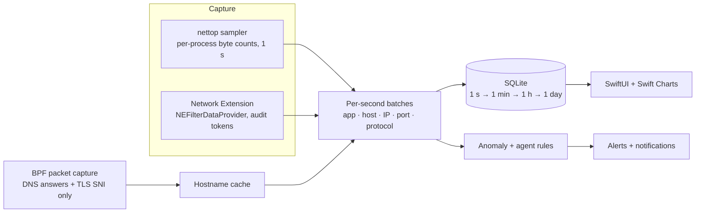

<div align="center">


# Flowlight

**See every connection your Mac makes, and every move your AI agents make.**

A native macOS network monitor that ties each byte to the app that sent it and the domain it went to.
It watches AI agents for the things you'd never approve: emailing files, opening SSH sessions, or
uploading your repo while you're away.

[**Download for macOS**](https://github.com/xinbetween/flowlight/releases/latest) ·
[Website](https://flowlight.xinbetween.com) ·
[Build from source](#build-from-source) ·
[How it works](#how-it-works)


</div>

---

## Why Flowlight

Your Mac now runs software that makes its own decisions. Coding agents read your files, run shell commands
and call tools, and any of those tools can open a socket. Activity Monitor shows *how much* traffic there
is. A firewall asks you to allow *each* connection. Neither answers the question that matters now:

> **What are my agents talking to, besides their model provider?**

Flowlight answers that for every app on your Mac, then goes deeper for AI agents.

## Features

### Every app × every domain × every protocol
- **Per-app attribution** for every TCP and UDP flow, including CLI tools and background daemons, not just windows.
- **Real hostnames, not bare IPs.** Taken from TLS server names and DNS answers seen on the wire, with an optional
  fallback to the network owner (*Cloudflare, Inc. · AS13335*).
- **108 protocols in 13 families**, recognized by port and by content:
  web (HTTP/1–3, QUIC, WebSocket) · email (SMTP, submission, IMAP, POP3 and their TLS variants) · file transfer
  (FTP/FTPS, SMB, AFP, NFS, rsync, git) · remote access (SSH, RDP, VNC, Telnet) · name resolution (DNS, DoT, DoH, DoQ,
  mDNS) · VPNs and tunnels (WireGuard, OpenVPN, IPsec, Tailscale, SOCKS, Tor) · databases (Postgres, MySQL, Redis,
  MongoDB…) · messaging and queues (MQTT, AMQP, Kafka, XMPP, IRC) · voice and video (SIP, STUN, RTSP) · and more.

### AI Agent Watch
Flowlight recognizes **15 agents** by name (Claude Code, Codex, Cursor, Windsurf, GitHub Copilot, Gemini CLI,
Aider, Goose, Ollama and more). It also finds **any other process that calls one of 21 LLM API providers**, so a
Python script hitting `api.openai.com` shows up too. Browsers are excluded, because a person chatting isn't an agent.

For each agent you see which AI providers it uses, and **everything else it contacted**. These rules watch it:

| Rule | Fires when an agent… | Severity |
|---|---|---|
| **Sensitive channel** | uses email, file transfer, SSH or remote desktop, a tunnel or proxy, peer-to-peer, or a database connection | critical for email, file transfer, tunnels and P2P |
| **Possible exfiltration** | uploads more than 100 MB/hour to hosts that aren't AI providers | critical |
| **Unnamed host** | connects to a raw IP with no hostname on an unusual port | warning |
| **Active while you're away** | moves data after 15 minutes without keyboard or mouse input | warning |
| **Fast learning** | new destinations are flagged after a 1-hour learning period (24 hours for other apps) | info |

Every threshold is adjustable in Settings.

### Reports at any zoom
- Second, minute, hour, day, week, month and year views. Click a bar to zoom in.
- Group the breakdown by **App › Domain › IP**, **Destination › App › IP**, or **IP › App**.
- Donut and trend charts with a top-5 + *Other* layout that stays readable with hundreds of apps.
- Hover any bucket to see which apps drove it. Export to CSV.

### Anomaly detection you can explain
Per-app baselines (EWMA + z-score) for hourly volume and daily destination counts, 99th-percentile upload checks,
first contact with a new domain, non-standard ports, and uploads from apps you haven't touched. Every alert names
the app, the destination and the number that tripped it.

### Private by design
No account, no cloud, no telemetry. Everything stays in a local SQLite database. Packet capture reads only DNS
answers and TLS ClientHellos (a kernel filter drops everything else), and **packet contents are never stored**.
The one optional network lookup (who owns an IP) is **off by default**. If you turn it on, it sends public IPs to
Team Cymru's DNS service.

<table>
<tr>
<td></td>
<td></td>
</tr>
<tr>
<td align="center"><sub>Reports: every granularity, every grouping</sub></td>
<td align="center"><sub>Alerts: explainable, per app</sub></td>
</tr>
</table>

## Install

1. Download **Flowlight.pkg** from the [latest release](https://github.com/xinbetween/flowlight/releases/latest)
   and open it. Flowlight installs into `/Applications`.
2. Launch Flowlight. Traffic appears within a second, and the ↓↑ rates live in your menu bar.
3. On first launch, **Name Your Traffic** offers the one-time setup that lets Flowlight read hostnames (it asks
   for your password once) and, optionally, network-owner lookups.

> **Try it without your own data:** `open /Applications/Flowlight.app --args -FLDemo YES` launches with 90 days
> of synthetic traffic. That's what the screenshots show.

### Build from source

```sh
brew install xcodegen
git clone https://github.com/xinbetween/flowlight.git && cd flowlight
xcodegen generate
scripts/build-local.sh                  # ad-hoc signed, no Apple account needed
open build/Build/Products/Release/Flowlight.app
scripts/build-pkg.sh                    # optional: installer package
```

Requirements: macOS 15 or later, Xcode 16 or later. Internals and the Network Extension path are in
[docs/DEVELOPMENT.md](docs/DEVELOPMENT.md).

## How it works



Two capture engines produce the same per-second summaries:

| | **nettop sampler** (default) | **Network Extension** |
|---|---|---|
| Needs | nothing | Apple's `content-filter-provider` entitlement (paid developer account) |
| Attribution | process → app bundle | audit token → code-signing identity |
| Hostnames | TLS SNI + DNS from packet capture, reverse DNS, optional network owner | SNI, HTTP `Host`, system hostname, DNS |
| Short-lived flows | flows under ~1 s can be missed | every flow |

Storage rolls per-second rows into minute, hour and day tables. Week, month and year views read the daily table,
so a year of history stays fast.

## Honest limitations

- **TCP and UDP only.** That covers essentially all app traffic, but ICMP (ping) and other raw-IP protocols aren't attributed.
- **Per process, not per thread.** macOS attributes sockets to processes.
- **Encrypted payloads stay encrypted.** Flowlight reads metadata (hostnames, ports, byte counts). It never decrypts traffic.
- **Hostname capture follows the primary interface.** Traffic confined to another interface or tunnel may lack names.
- **QUIC server names** come from DNS rather than the encrypted QUIC handshake.
- **Release builds aren't notarized yet.** The first launch may need right-click › Open.

## Roadmap

- [ ] Signed and notarized releases, and a Homebrew cask
- [ ] Per-agent allowlists ("Claude Code may talk to GitHub and npm, nothing else")
- [ ] Block rules in Network Extension mode
- [ ] MCP server attribution (which tool call opened the socket)
- [ ] Export to OpenTelemetry / SIEM

## Contributing

Issues and PRs are welcome. Adding an agent, an LLM provider or a protocol is a one-line change plus a test. See
[CONTRIBUTING.md](CONTRIBUTING.md).

```
Shared/              models, XPC contract, protocol classifier + catalog, SNI/HTTP/DNS parsers
FlowlightExtension/  NEFilterDataProvider system extension
Flowlight/
  Capture/           nettop sampler, extension client, installer
  Enrichment/        BPF packet capture, network-owner lookup
  Storage/           SQLite store, rollups, queries
  Analysis/          anomaly engine, AI agent catalog + rules
  UI/                Live · AI Agents · Reports · Alerts · Capture
FlowlightTests/      41 unit tests: parsers, BPF filter, rollups, charts, agents, anomalies
docs/                website (GitHub Pages) and developer guide
```

## License

[MIT](LICENSE). Flowlight isn't affiliated with Apple or with any AI provider named here. Product names are
trademarks of their owners.
