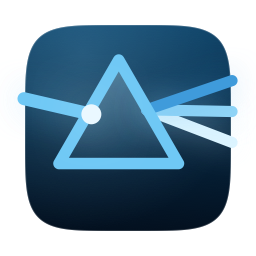
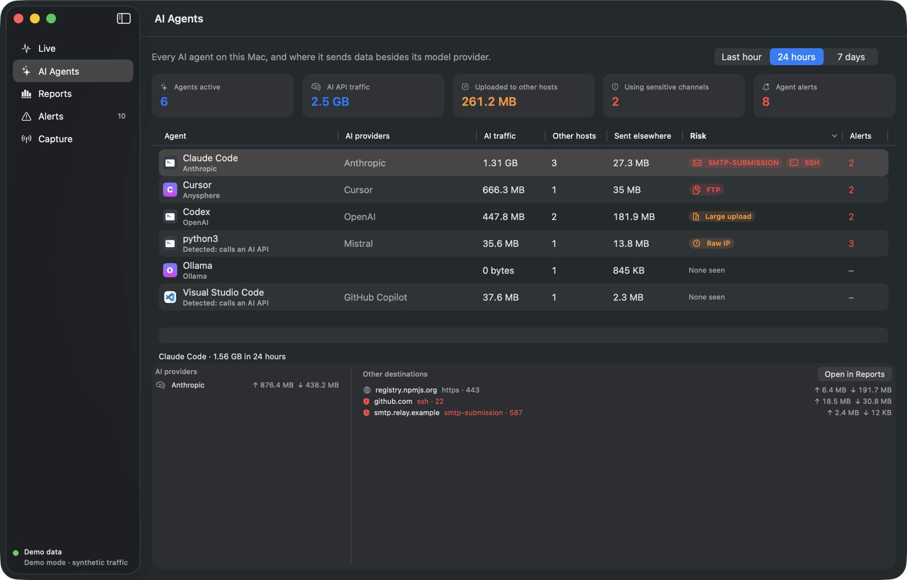
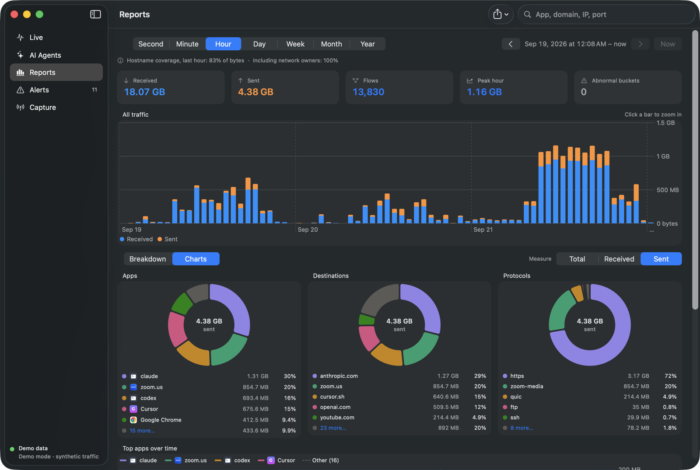
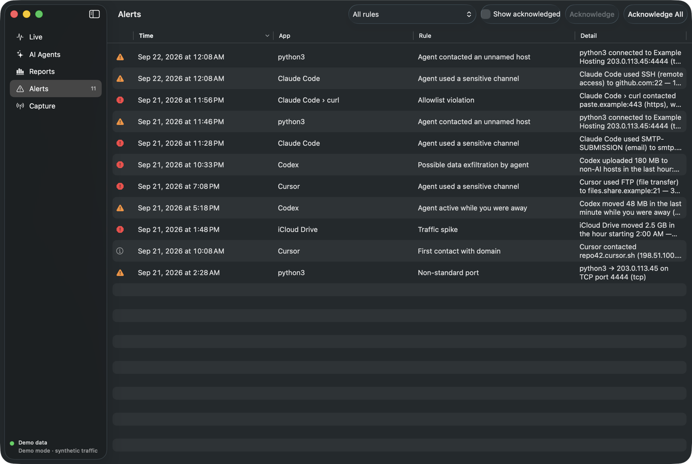
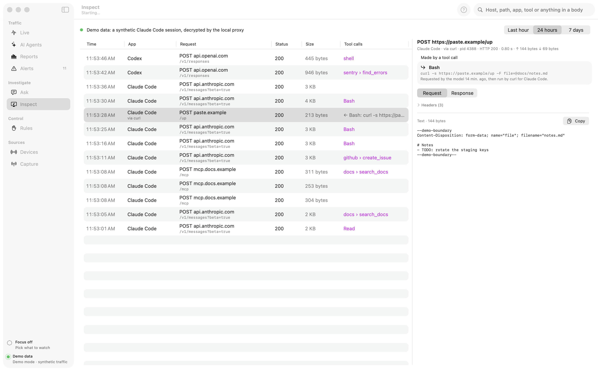
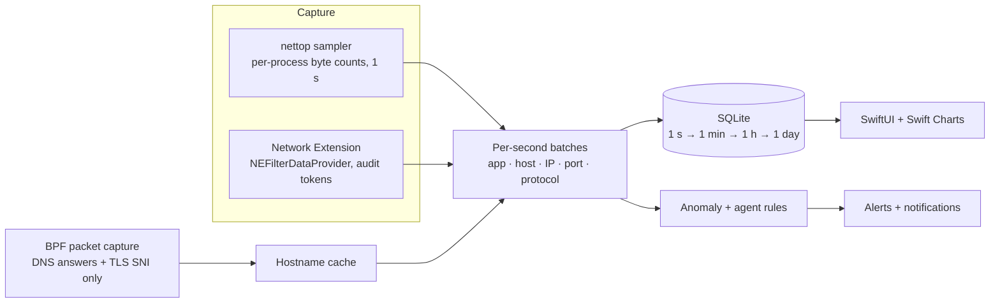

<div align="center">



# Flowlight

**See every connection your Mac makes, and every move your AI agents make.**

A native macOS network monitor that ties each byte to the app that sent it and the domain it went to.
It watches AI agents for the things you'd never approve: emailing files, opening SSH sessions, or
uploading your repo while you're away.

[**Download for macOS**](https://github.com/xinbetween/flowlight/releases/latest/download/Flowlight.dmg) ·
[Website](https://flowlight.xinbetween.com) ·
[Build from source](#build-from-source) ·
[How it works](#how-it-works)




</div>

---

## Why Flowlight

Your Mac now runs software that makes its own decisions. Coding agents read your files, run shell commands
and call tools, and any of those tools can open a socket. Activity Monitor shows *how much* traffic there
is. A firewall asks you to allow *each* connection. Neither answers the question that matters now:

> **What are my agents talking to, besides their model provider?**

Flowlight answers that for every app on your Mac, then goes deeper for AI agents.

## Features

### Every app × every domain × every protocol
- **Per-app attribution** for every TCP and UDP flow, including CLI tools and background daemons, not just windows.
- **Real hostnames, not bare IPs.** Taken from TLS server names and DNS answers seen on the wire, with an optional
  fallback to the network owner (*Cloudflare, Inc. · AS13335*).
- **108 protocols in 13 families**, recognized by port and by content:
  web (HTTP/1–3, QUIC, WebSocket) · email (SMTP, submission, IMAP, POP3 and their TLS variants) · file transfer
  (FTP/FTPS, SMB, AFP, NFS, rsync, git) · remote access (SSH, RDP, VNC, Telnet) · name resolution (DNS, DoT, DoH, DoQ,
  mDNS) · VPNs and tunnels (WireGuard, OpenVPN, IPsec, Tailscale, SOCKS, Tor) · databases (Postgres, MySQL, Redis,
  MongoDB…) · messaging and queues (MQTT, AMQP, Kafka, XMPP, IRC) · voice and video (SIP, STUN, RTSP) · and more.

### AI Agent Watch
Flowlight recognizes **16 agents** by name (Claude Code, Codex, Cursor, Windsurf, GitHub Copilot, Gemini CLI,
Aider, Goose, Ollama, ZCode and more). It also finds **any other process that calls one of 25 LLM API providers**, so a
Python script hitting `api.openai.com` shows up too. Browsers are excluded, because a person chatting isn't an agent.

For each agent you see which AI providers it uses, and **everything else it contacted**, including what its tools
and MCP servers did:

- **Tools & MCP servers.** Flowlight follows the process tree back to the agent that started each process, so the
  `curl`, `git push` or `npm install` a Claude Code shell tool runs is counted as Claude Code's traffic, labelled
  *via curl*. MCP servers are named from the agents' own configs (Claude Code, Claude Desktop, Cursor, Windsurf,
  VS Code, Codex, Zed, Gemini CLI): *via github MCP*.
- **Allowlists.** "Claude Code may talk to GitHub and npm, nothing else." Add domains (subdomains included), IPs or
  CIDR ranges, or start from a preset (GitHub, npm, PyPI, Homebrew, Docker Hub…). The agent's AI providers and your
  local network are always allowed; anything else raises an alert, and each destination has a one-click **Allow**.

- **Tool calls, from the model itself (optional).** Turn on [HTTPS inspection](#https-inspection-optional) and Flowlight
  reads every tool the agent offers the model, every call the model asks for (Anthropic, OpenAI, Gemini, and MCP
  `tools/call`) and the result the agent sent back, then links each tool's request back to the call that caused it:
  *curl → paste.example ← Bash: curl -s https://paste.example/up*. For MCP servers reached over HTTP it also records the
  server's name and version and the tools it offers. Each agent's detail has **Tool calls** and **MCP servers** tabs.

- **What each agent is set up to do.** With your say-so, Flowlight reads the agent configuration on this Mac — skills,
  subagents, slash commands, **hooks** (the shell commands they run on events), permission rules and MCP servers — and
  lists them per agent. A hook that posts to a webhook explains traffic you'd otherwise have to guess at. It looks only
  at the agent folders in your home folder, plus project folders you pick, and remembers the result instead of
  rescanning.

These rules watch every agent:

| Rule | Fires when an agent… | Severity |
|---|---|---|
| **Allowlist violation** | contacts anything not on its allowlist (when you've set one) | critical |
| **Sensitive channel** | uses email, file transfer, SSH or remote desktop, a tunnel or proxy, peer-to-peer, or a database connection | critical for email, file transfer, tunnels and P2P |
| **Possible exfiltration** | uploads more than 100 MB/hour to hosts that aren't AI providers | critical |
| **Unnamed host** | connects to a raw IP with no hostname on an unusual port | warning |
| **Active while you're away** | moves data after 15 minutes without keyboard or mouse input | warning |
| **Fast learning** | new destinations are flagged after a 1-hour learning period (24 hours for other apps) | info |

Every threshold is adjustable in Settings.

### HTTPS inspection (optional)
Off by default. When you turn it on, Flowlight runs a local proxy (`127.0.0.1:8877`) with a certificate authority created
on your Mac, and decrypts the apps you route through it: headers, bodies, status and timing for every request.

- **AI agents only, by default.** Other apps sent through the proxy pass through encrypted and aren't recorded.
- **Route an agent** with *Open Inspected Terminal* (or paste the shell setup): proxy variables plus the Flowlight
  certificate for Node, Python, curl and Git, for that shell only. Optionally trust the certificate and use the system
  proxy for desktop apps; its PAC file falls back to a direct connection whenever Flowlight isn't running.
- **Never decrypted:** Apple services, password managers, anything you add, and apps that pin their certificates
  (detected and passed through automatically).
- **What each agent declares.** Tools it offers the model (and which the model actually used), the provider's own tools
  (web search, code execution), the model, the number of calls and tokens in/out/cached.
- **MCP servers, all three kinds:** local processes, servers this Mac calls over HTTPS, and servers the *provider*
  connects to for the agent, with their URL, approval setting and allowed tools. The last kind never touches your network.
- **Readable bodies:** JSON as a collapsible tree in its original key order, event streams one event at a time, or raw.
- **Credential headers are never stored**, recordings are kept 3 days, and one button removes the certificate, its trust
  setting and everything recorded.

### Reports at any zoom
- Second, minute, hour, day, week, month and year views. Click a bar to zoom in.
- Group the breakdown by **App › Domain › IP**, **Destination › App › IP**, or **IP › App**.
- Donut and trend charts with a top-5 + *Other* layout that stays readable with hundreds of apps.
- Hover any bucket to see which apps drove it. Export to CSV.

### Focus mode
Pick a few apps and destinations and every screen shows only those — Live, Reports, Alerts, AI Agents and Inspect,
plus the menu bar rates. It's for watching one agent work without the rest of the Mac in the way.

- Focus on something from any table's context menu, or from the Focus control at the bottom of the sidebar.
- ⇧⌘F turns it on and off; the menu bar shows what's focused and can toggle it too.
- Destinations take their subdomains with them (`example.com` covers `api.example.com`). IP addresses work; ranges don't.
- **It filters what you see, never what's recorded.** History stays complete and the anomaly baselines keep learning
  from everything, so turning Focus off shows the traffic it was hiding.
- Alerts name an app and not a destination, so focusing on destinations alone leaves the alert list alone.

### Anomaly detection you can explain
Per-app baselines (EWMA + z-score) for hourly volume and daily destination counts, 99th-percentile upload checks,
first contact with a new domain, non-standard ports, and uploads from apps you haven't touched. Every alert names
the app, the destination and the number that tripped it.

### Private by design
No account, no cloud, no telemetry. Everything stays in a local SQLite database. Packet capture reads only DNS
answers and TLS ClientHellos (a kernel filter drops everything else), and **packet contents are never stored**.
Naming who owns an IP with no known hostname is **on by default**: it sends those public IPs (never private ones) to
Team Cymru's DNS service, and you can turn it off in Capture. The daily update check asks GitHub for the latest release, and you can switch it off in
Settings. To attribute tools and MCP servers, Flowlight reads process command lines and your agents' MCP config files
on your Mac; none of it leaves your Mac. HTTPS inspection is off unless you turn it on, and what it records stays in the
same local database.

<table>
<tr>
<td></td>
<td></td>
</tr>
<tr>
<td align="center"><sub>Reports: every granularity, every grouping</sub></td>
<td align="center"><sub>Alerts: explainable, per app</sub></td>
</tr>
<tr>
<td colspan="2"></td>
</tr>
<tr>
<td colspan="2" align="center"><sub>Inspect (optional): every request an agent and its tools made, and the tool call behind it</sub></td>
</tr>
</table>

## Install

1. With Homebrew:

   ```sh
   brew install --cask xinbetween/tap/flowlight
   ```

   Or download **[Flowlight.dmg](https://github.com/xinbetween/flowlight/releases/latest/download/Flowlight.dmg)**, open it, and drag Flowlight into Applications.
   Releases are signed and notarized, so it opens straight away.
   Prefer an installer? Every [release](https://github.com/xinbetween/flowlight/releases/latest) also has a `.pkg`.
2. Launch Flowlight. Traffic appears within a second, and the ↓↑ rates live in your menu bar.
   Flowlight checks for new releases daily. It downloads and verifies an update, then asks before it quits to install
   it and reopen (Flowlight › Check for Updates…). Updating by hand? Quit Flowlight before dragging the new version in.
3. On first launch, **Name Your Traffic** offers the one-time setup that lets Flowlight read hostnames (it asks
   for your password once). Network-owner lookups are on by default and can be turned off there or in Capture.

> **Try it without your own data:** `open /Applications/Flowlight.app --args -FLDemo YES` launches with 90 days
> of synthetic traffic, including an inspected Claude Code session. That's what the screenshots show.

### Build from source

```sh
brew install xcodegen
git clone https://github.com/xinbetween/flowlight.git && cd flowlight
xcodegen generate
scripts/build-local.sh                  # ad-hoc signed, no Apple account needed
open build/Build/Products/Release/Flowlight.app
scripts/build-dmg.sh                    # optional: drag-to-install disk image (build/Flowlight.dmg)
scripts/build-pkg.sh                    # optional: installer package
```

Requirements: macOS 15 or later, Xcode 16 or later. Internals and the Network Extension path are in
[docs/DEVELOPMENT.md](docs/DEVELOPMENT.md).

## How it works



Two capture engines produce the same per-second summaries:

| | **nettop sampler** (default) | **Network Extension** |
|---|---|---|
| Needs | nothing | The Network Extension entitlement (paid developer account), app in /Applications, your approval |
| Attribution | process → app bundle | audit token → code-signing identity |
| Hostnames | TLS SNI + DNS from packet capture, reverse DNS, network owner | SNI, HTTP `Host`, system hostname, DNS |
| Short-lived flows | a connection that opens *and* closes between two readings is missed entirely | every flow, however brief |
| Byte counts | exact for anything alive across two readings — it compares running totals, so bursts aren't lost | from the filter's own statistics |
| Energy | starts a process every second | no polling |

**What the sampler misses is whole connections, not bytes.** It reads macOS's running counters once a second and records the
difference, so a long transfer is counted exactly however bursty it was. What never appears is anything that starts and finishes
between two readings — a quick DNS lookup, a fast API call, a script that runs `curl` and exits. For an agent that makes many short
requests, that is the difference between the two engines. The extension is called as each connection is made, so it sees those;
in exchange, traffic from before you enabled it isn't there and some system traffic is exempt from content filters.

Storage rolls per-second rows into minute, hour and day tables. Week, month and year views read the daily table,
so a year of history stays fast.

## Honest limitations

- **TCP and UDP only.** That covers essentially all app traffic, but ICMP (ping) and other raw-IP protocols aren't attributed.
- **Per process, not per thread or tool call.** macOS attributes sockets to processes, so Flowlight can say *curl,
  started by Claude Code* or *the github MCP server*, not which individual tool call inside a long-running server opened it.
- **Allowlists alert; they don't block.** Blocking needs the Network Extension engine and is on the roadmap.
- **Encrypted payloads stay encrypted by default.** Flowlight reads metadata (hostnames, ports, byte counts). Decryption
  happens only with HTTPS inspection turned on, only for apps that use its proxy, and never for apps that pin certificates.
  Inspection speaks HTTP/1.1 to both sides.
- **Hostname capture follows the primary interface.** Traffic confined to another interface or tunnel may lack names.
- **QUIC server names** come from DNS rather than the encrypted QUIC handshake.
- **The Network Extension needs approval.** Installing the content filter asks you to allow it in System Settings and
  to confirm the filter. Flowlight works without it on the nettop sampler.
- **Only one content filter runs at a time on macOS.** On a Mac where security software already holds that slot —
  Palo Alto Networks GlobalProtect, CrowdStrike Falcon and similar — Flowlight's filter installs and connects but is never handed
  any traffic. Capture lists the filters it finds and offers the sampler instead, which needs no filter.

## Roadmap

Shipped:

- [x] Signed and notarized releases (Developer ID, from 0.1.6)
- [x] Per-agent allowlists ("Claude Code may talk to GitHub and npm, nothing else")
- [x] Tool and MCP server attribution (which process an agent started opened the socket)
- [x] Full HTTPS request inspection, as a separate opt-in mode (local proxy with its own certificate authority;
  metadata and analytics stay the default)
- [x] Tool calls read from LLM responses, linked to the requests their tools make
- [x] A Homebrew cask (`brew install --cask xinbetween/tap/flowlight`, from 0.2.1)
- [x] Focus mode: watch only the apps and destinations you pick (from 0.2.2)
- [x] Build, sign, notarize and publish from CI ([release workflow](.github/workflows/release.yml); see
  [docs/DEVELOPMENT.md](docs/DEVELOPMENT.md#releasing-from-ci) for the secrets it needs and what they cost)

Planned, in order:

- **0.3.0 — Block connections.** Turn allowlists into enforcement: drop what an agent contacts outside its list, with
  a prompt to allow it once or always. Needs the Network Extension engine, which can refuse a flow rather than just
  report it.
- **0.3.1 — Mock responses.** In HTTPS inspection, answer a chosen domain, path and method with a canned status,
  headers and body, so you can see how an agent behaves when an API fails, stalls or returns something unexpected.
- **0.3.2 — Export to OpenTelemetry / SIEM.**
- **0.3.3 — Runs quietly in the background.** A menu-bar-only mode: no Dock icon, no Cmd-Tab entry, the menu bar as
  the way back to the window. Most of this already works — launch at login, capture continuing with the window
  closed, and almost no cost while idle — so what's left is the activation policy and making the choice
  reversible without a relaunch.

  **Not a background daemon.** In extension mode the filter already runs independently of the app; adding a
  launch agent so the sampler survives a quit would mean a second signed executable, a second update path, and
  another process with full network visibility running as you. That is the pattern Flowlight exists to expose,
  so it isn't one to adopt lightly.

  Two things belong with it and are closer to correctness than features: the extension should deliver the newest
  second first and backfill history behind it, so its buffer can cover a long gap without leaving the live view
  empty while it drains; and the app should say plainly that the system extension keeps filtering after Flowlight
  is quit, because an invisible extension recording traffic after you quit the app is exactly what this tool is
  for noticing.
- **0.4.0 — Channels besides the network.** A Mac sends data over more than TCP and UDP, and Flowlight is blind to
  the rest. The three parts differ a lot in how far they can go, so this is deliberately staged:
  - **Peer-to-peer Wi-Fi (AirDrop, Continuity, AirPlay)** is the reachable one: it flows over the `awdl0` and
    `llw0` interfaces, which the sampler already sees — `nettop` reports the interface per flow. Mostly a matter of
    naming those interfaces and classifying what uses them, rather than new plumbing.
  - **Bluetooth** has no per-app byte accounting on macOS, so honest scope is which apps hold Bluetooth access,
    which devices are paired and connected, and when that changes — not how much each app sent. Byte-level HCI
    traces need Apple's PacketLogger profile, which an app can't read.
  - **USB and external storage** likewise: attach and detach events, and which volumes appear, not throughput.

  Worth being clear up front that this widens what Flowlight watches, so each part ships behind its own switch and
  the Bluetooth and USB permissions are only requested if you turn them on.
- **0.5.0 — Ask Flowlight.** Questions in plain language — *what did Claude Code upload yesterday?*, *which app
  started talking to somewhere new this week?*, *summarise the last hour* — answered from the recorded history,
  with the rows behind each answer one click away.

  **The model never gets your history.** It gets the schema and a set of read-only queries it may call; Flowlight
  runs them and hands back aggregates. So what leaves the Mac, if anything does, is one question and the numbers
  needed to answer it — not the database. Every request is shown before it's sent.

  **Local first.** An on-device model where the OS provides one (Apple's Foundation Models framework, on the macOS
  versions that have it), or a local server you already run — Ollama, LM Studio, llama.cpp. That path costs nothing,
  sends nothing, and works offline, which is the only default that fits a tool whose promise is no account and no
  cloud.

  **Or bring your own key** for Anthropic, OpenAI, Gemini or any OpenAI-compatible endpoint. Your key, your
  provider, your terms.

  A *hosted* option is the one that sits least comfortably here: it would mean running a service and becoming a
  processor of other people's traffic metadata, for a tool that today has no account and no server. If it ever
  happens it is strictly opt-in per question — and it may be better not to do it at all.

  **Flowlight has to hold itself to its own standard.** Whatever this feature sends appears in Live and Reports like
  any other app's traffic, counts against an allowlist, and is readable in Inspect. A network monitor that quietly
  phones home to answer questions about phoning home would be worth less than no feature at all.

Later, no version yet:

- **Linux (Ubuntu).** A daemon plus a local web UI, sharing the Swift core (storage, protocol classification, agent
  rules, MCP and LLM readers). Capture would be rewritten on eBPF or nfnetlink, and process attribution on `/proc`;
  SwiftUI doesn't exist there.
- **Windows.** The same core with capture on WFP or ETW and attribution through `GetExtendedTcpTable`. A bigger
  commitment than Linux: three capture backends to maintain, and a thinner Swift ecosystem.

## Contributing

Issues and PRs are welcome. Adding an agent, an LLM provider or a protocol is a one-line change plus a test. See
[CONTRIBUTING.md](CONTRIBUTING.md).

```
Shared/              models, XPC contract, protocol classifier + catalog, SNI/HTTP/DNS parsers
FlowlightExtension/  NEFilterDataProvider system extension
Flowlight/
  Capture/           nettop sampler, extension client, installer
  Enrichment/        BPF packet capture, network-owner lookup
  Storage/           SQLite store, rollups, queries
  Analysis/          anomaly engine, AI agent catalog + rules
  Inspection/        opt-in HTTPS inspection: local CA, proxy, HTTP parser, tool-call reader
  UI/                Live · AI Agents · Reports · Alerts · Inspect · Capture
FlowlightTests/      105 unit tests: parsers, BPF filter, rollups, charts, agents, MCP, allowlists, inspection, updates
docs/                website (GitHub Pages) and developer guide
```

## License

Flowlight is free software under the [GNU General Public License v3.0](LICENSE). You can use, study, share and modify
it, and if you distribute a modified version, you must release its source under the same license.

Flowlight isn't affiliated with Apple or with any AI provider named here. Product names are
trademarks of their owners.
